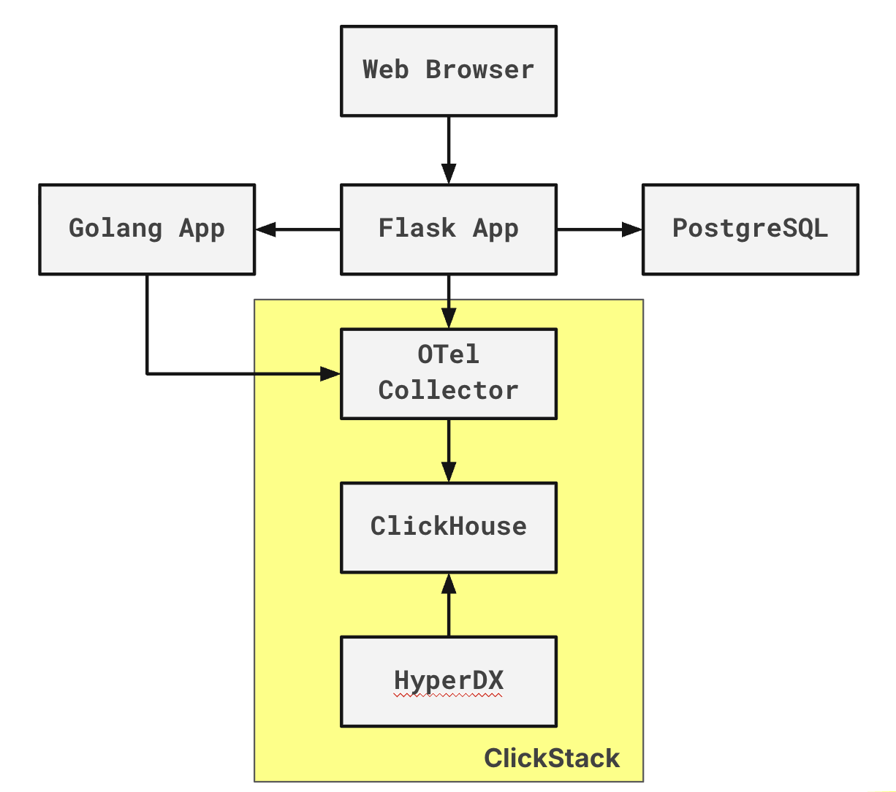
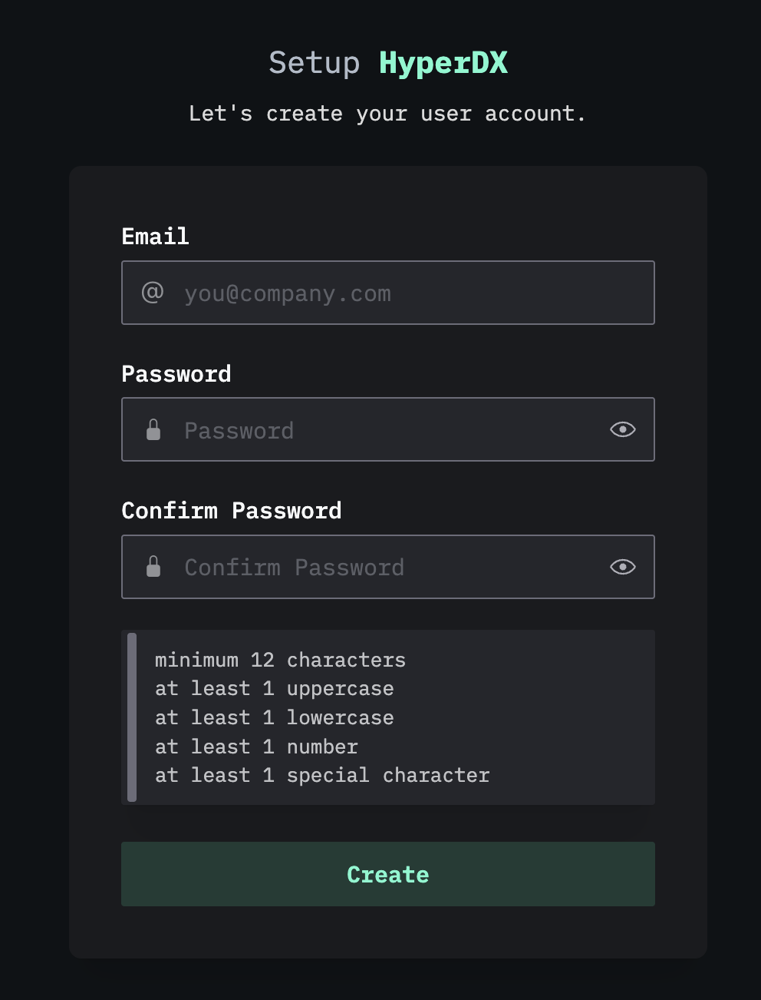
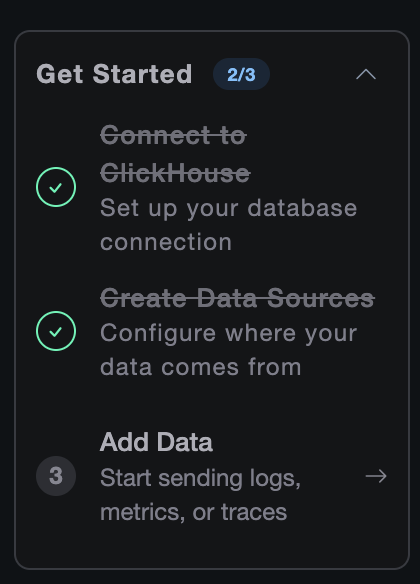

# ClickHouse Subscription App

A Flask-based web application that showcases ClickHouse features while collecting user subscriptions. The app is fully instrumented with HyperDX OpenTelemetry for observability and monitoring.

## Overview

This project demonstrates:
- **ClickHouse Integration**: Stores subscription data in a ClickHouse database
- **HyperDX Observability**: Full OpenTelemetry instrumentation for monitoring and debugging, both in front-end (browser) and back-end (Python)

## Architecture


## Quick Start

1. **Clone the repo**
   ```bash
   git clone https://github.com/ClickHouse/hyperdx_demo
   cd hyperdx_demo
   ```

2. **Start ClickStack**
   ```bash
   docker compose up clickstack -d
   ```

3. **Access ClickStack**
   - http://localhost:8080

4. **Setup HyperDX by creating username and password that meet the requirements**
   

5. **Click Add Data**
   

6. **Copy your ingestion API Key**

7. **Paste your ingestion API Key**
   ```bash
   echo "HYPERDX_API_KEY=paste-your-api-key-here" > .env
   ```

8. **Start the remaining services**
   ```bash
   docker compose --env-file .env up -d
   ```

9. **(Optional) Add ClickStack to hosts**
   ```bash
   sudo echo "127.0.0.1 clickstack" >> /etc/hosts
   ```

10. **(Optional) Access the subscription app in your browser**
    - http://localhost:8000

## Contributing

1. Fork the repository
2. Create a feature branch (`git checkout -b feature/amazing-feature`)
3. Commit changes (`git commit -m 'Add amazing feature'`)
4. Push to branch (`git push origin feature/amazing-feature`)
5. Open a Pull Request

## Support

- **ClickHouse Documentation**: https://clickhouse.com/docs
- **HyperDX Documentation**: https://docs.hyperdx.io
- **Flask Documentation**: https://flask.palletsprojects.com
