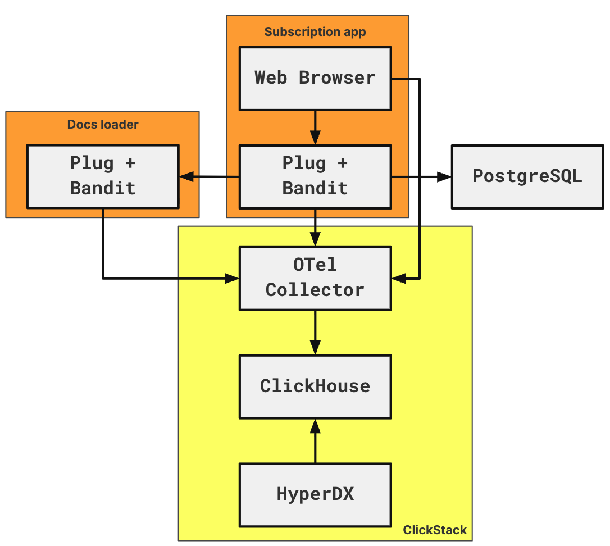

# ClickHouse Subscription Demo App

A Flask-based web application that showcases ClickHouse features while collecting user subscriptions. The app is fully instrumented with HyperDX OpenTelemetry for observability and monitoring.

## Overview

This project demonstrates ClickStack Observability through full OpenTelemetry instrumentation for monitoring and debugging, both in front-end (browser) and back-end (Python and Go).
After the data is sent from the OpenTelemetry collector to ClickHouse, it is possible to use HyperDX to visualize data and get insights.

## Architecture

=======

## Quick Start

1. **Create a ClickHouse Cloud service**
    - https://console.clickhouse.cloud

2. **Clone the repo**
   ```bash
   git clone https://github.com/ClickHouse/clickstack-demo-subscription-app
   ```

3. **Access the main directory**
   ```bash
   cd clickstack-demo-subscription-app
   ```

4. **Create a .env file**
   ```bash
   CLICKHOUSE_ENDPOINT=<HOST-WITH-PORT>
   CLICKHOUSE_USER=default
   CLICKHOUSE_PASSWORD=<PASSWORD>
   HYPERDX_API_KEY=<INGESTION-PASSWORD>
   ```

5. **Edit .env with the connection information to your service**

6. **Edit .env with your own HyperDX API key to securely ingest data**

7. **Start all services**
   ```bash
   docker compose up -d
   ```

8. **(Optional) Access the subscription app in your browser**
    - http://localhost:8000

## Contributing

1. Fork the repository
2. Create a feature branch (`git checkout -b feature/amazing-feature`)
3. Commit changes (`git commit -m 'Add amazing feature'`)
4. Push to branch (`git push origin feature/amazing-feature`)
5. Open a Pull Request

## Support

- **ClickHouse Documentation**: https://clickhouse.com/docs
- **ClickStack Documentation**: https://clickhouse.com/docs/use-cases/observability/clickstack
